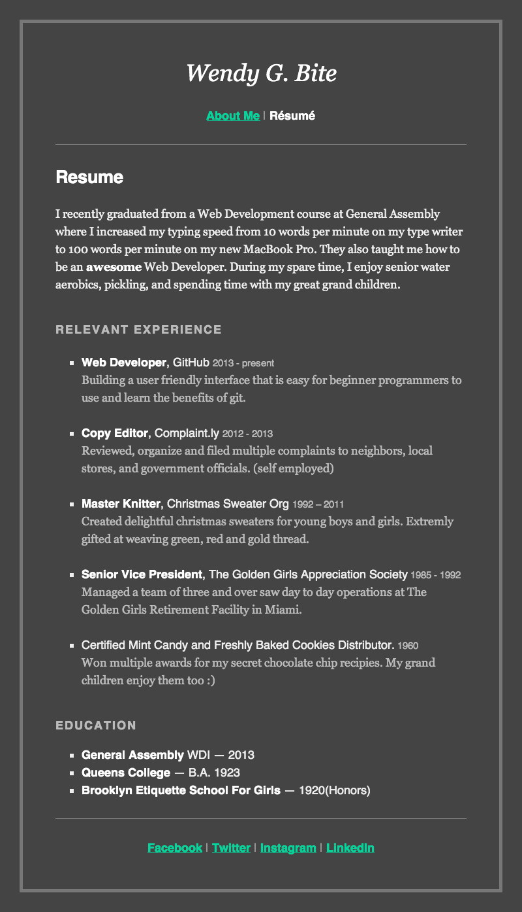

##Week 7 - Day 1 - Web Development Fundamentals, HTML, and CSS

Day 1 of Week 7 is all about introducing students to key terms and concepts related to front-end web development, and getting their feet wet with HTML and CSS.   

Main Project for Day 1: Wendy G Bite: 

