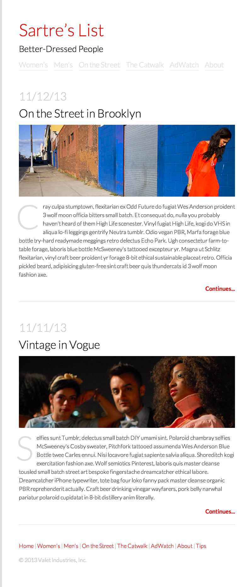

###Week 7 - Day 2: Advanced CSS and Forms

Day 2 of Week 7 is about more complex CSS topics, including floats and positioning elements on the page in addition to creating DIVs and differentiating between classes and Ids. 

Today will also introduce forms and text input to students. 

__There are two daily projects for Day 2.__

__Day 2 Mini Project:__ Fashion Blog.

 

 

__Day 2 Final Project:__ Simple Marketing Site.

 

[Click here for the solution code](06_workshop_html_and_advanced_css_lab/solution/simple_marketing_site/index.html)

 