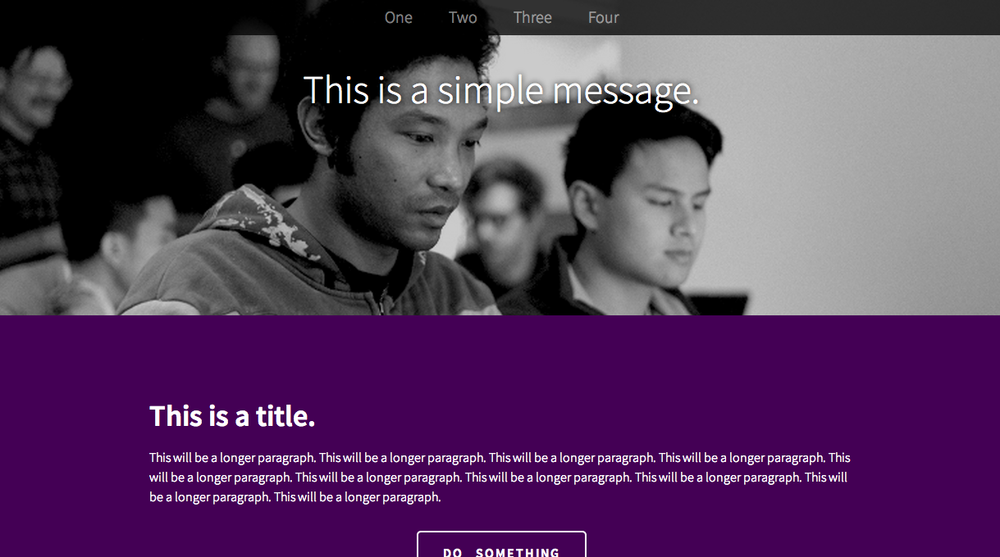

###Week 7 - Day 3: Advanced CSS

During Day 3 of Week 7, students will go deeper into advanced CSS

__There are two daily projects for Day 2.__

__Day 3 Mini Project:__ Fashion Blog.

 

 

__Day 2 Final Project:__ Simple Marketing Site.

 

[Click here for the solution code](06_workshop_html_and_advanced_css_lab/solution/simple_marketing_site/index.html)

 

