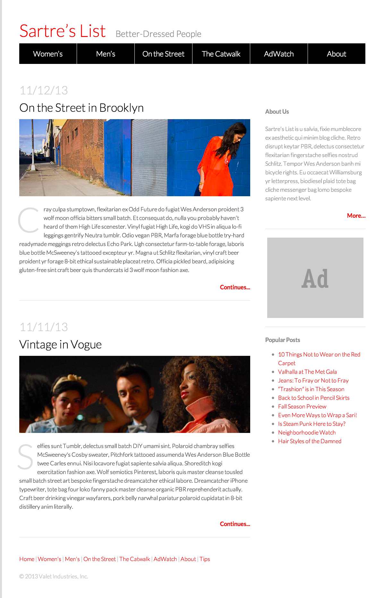

###Week 7 - Day 3: Responsive Design

During Day 3 of Week 7, students will learn about responsive design. 

__There is one daily project for Day 3.__

__Day 3 Project:__ [Responsive Fashion Blog](08_workshop_responsive_fashion_blog/solution/fashion_blog_part2/index.html)

 

